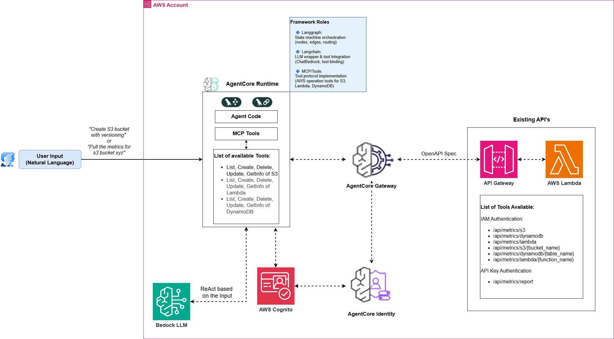

# AWS Resource Manager - Agentic AI Application

> An intelligent AWS resource management application powered by AWS Bedrock LLM, Langchain/Langgraph agents, and MCP tools for natural language-based infrastructure management.

**Quick Start**: See [docs/DEPLOYMENT_GUIDE.md](docs/DEPLOYMENT_GUIDE.md) | **Deploy in 5 minutes** ⚡

> **Note**: Currently this contains only the code related to AWS AgentCore Runtime, Gateway and Identity components. The code for the External APIs (Resource Utilization Reporting) is available at: [https://github.com/techwithashish1/resource-utlization-reporting-app](https://github.com/techwithashish1/resource-utlization-reporting-app)

---

## Table of Contents

1. [Overview](#overview)
2. [Two Tool Architecture](#two-tool-architecture)
3. [AgentCore Memory](#agentcore-memory)
4. [Architecture](#architecture)
5. [Project Structure](#project-structure)
6. [Getting Started](#getting-started)

---

## Overview

### What is This?

This application provides an **AI-powered interface** to manage AWS resources through natural language interactions. It uses **AWS Bedrock LLM models** (Claude 3 Sonnet) to understand commands and orchestrate AWS operations through a **Langgraph state machine** with **Langchain tool integration** and **MCP (Model Context Protocol) tools**. This application demonstrate how to use and expose existing API's to Agents deployed on AWS AgentCore Runtime without changing the API. 

**Architecture Highlights:**
- 🤖 **Langgraph StateGraph**: Multi-step agent workflow with conditional routing
- 🔗 **Langchain Integration**: ChatBedrock wrapper with tool binding
- ⚡ **Claude 3 Sonnet**: AWS Bedrock LLM for reasoning and decision-making
- 🛠️ **Two Tool Sets**: Local tools (built-in) + Gateway tools (external APIs)
- 🌐 **AgentCore Gateway**: Exposes existing APIs as MCP tools with JWT authentication
- 🔐 **AgentCore Identity**: Workload identity & token exchange for secure API access

### Key Features

✅ **Natural Language Interface**: Interact with AWS using plain English  
✅ **AgentCore Gateway**: Secure MCP tool exposure with Cognito JWT authentication  
✅ **AgentCore Identity**: Workload identity with OAuth2 token exchange  
✅ **AgentCore Memory**: Short-term and long-term memory for conversation context  
✅ **S3 Management**: Create, configure, manage buckets (bucket-level only)  
✅ **Lambda Management**: Create, update, manage Lambda functions  
✅ **DynamoDB Management**: Create, configure tables (table-level only)  
✅ **Metrics & Monitoring**: Retrieve CloudWatch metrics via gateway  
✅ **No Data Operations**: Infrastructure-only (no S3 objects, no DynamoDB scans)  
✅ **Production Ready**: Deploy on AWS Bedrock Agent Core in minutes  

### Technology Stack

| Component | Technology | Role |
|-----------|------------|------|
| **LLM** | AWS Bedrock (Claude 3 Sonnet) | AI decision-making & reasoning |
| **Agent Orchestration** | Langgraph 0.0.40+ | State machine workflow & routing |
| **LLM Integration** | Langchain 0.1+ | LLM wrapper, tools, prompts |
| **Tools Protocol** | Model Context Protocol (MCP) | Standardized tool interface |
| **Gateway** | AWS Bedrock AgentCore Gateway | Secure MCP tool exposure with JWT auth |
| **Identity** | AWS Bedrock AgentCore Identity | Workload identity & token exchange |
| **Memory** | AWS Bedrock AgentCore Memory | Short-term & long-term conversation memory |
| **Deployment** | AWS Bedrock Agent Core | Production runtime environment |
| **Language** | Python 3.11+ | Core implementation |
| **AWS SDK** | Boto3 1.34+ | AWS service integration |

---

## Two Tool Architecture

This application uses **two distinct sets of tools** that the agent can invoke:

| Aspect | Local Tools | Gateway Tools |
|--------|-------------|---------------|
| **Location** | Built into agent code (`src/mcp_tools/`) | Existing APIs exposed via Gateway |
| **Authentication** | Direct AWS SDK credentials | AgentCore Identity → Cognito JWT |
| **Implementation** | Custom Python code with Boto3 | Existing API endpoints (no code changes) |
| **Use Case** | Direct AWS operations, development | Production APIs, external services |
| **Setup Required** | None (included in agent) | Gateway + Identity configuration |

### Local Tools (Built-in)

These tools are implemented directly in the agent code and use AWS SDK (Boto3) for execution:

| Service | Tools |
|---------|-------|
| **S3** | `ListS3Buckets`, `CreateS3Bucket`, `DeleteS3Bucket`, `GetS3BucketInfo` |
| **Lambda** | `ListLambdaFunctions`, `CreateLambdaFunction`, `UpdateLambdaConfig`, `DeleteLambdaFunction`, `GetLambdaFunctionInfo` |
| **DynamoDB** | `ListDynamoDBTables`, `CreateDynamoDBTable`, `DescribeDynamoDBTable`, `UpdateDynamoDBTable`, `DeleteDynamoDBTable` |

### Gateway Tools (External APIs)

These tools access existing APIs exposed through AgentCore Gateway with authentication managed by AgentCore Identity:

**IAM Authentication (AWS Service Metrics):**
| Endpoint | Description |
|----------|-------------|
| `/api/metrics/s3` | List all S3 bucket metrics |
| `/api/metrics/s3/{bucket_name}` | Get metrics for specific S3 bucket |
| `/api/metrics/lambda` | List all Lambda function metrics |
| `/api/metrics/lambda/{function_name}` | Get metrics for specific Lambda function |
| `/api/metrics/dynamodb` | List all DynamoDB table metrics |
| `/api/metrics/dynamodb/{table_name}` | Get metrics for specific DynamoDB table |

**API Key Authentication (Custom Reports):**
| Endpoint | Description |
|----------|-------------|
| `/api/metrics/report` | Generate consolidated metrics report |

**When to Use Each:**
- **Local Tools**: Use for AWS operations where you want direct SDK access and custom logic (create, update, delete resources)
- **Gateway Tools**: Use to access existing APIs (like metrics endpoints) without modifying the API code. Authentication is handled by AgentCore Identity, making it secure and auditable.

---

## AgentCore Memory

AgentCore Memory enables the agent to maintain **conversation context** over time for personalized experiences.

### Memory Types

| Type | Description | Expiry |
|------|-------------|--------|
| **Short-Term** | Session-based conversation context | 7 days |
| **Long-Term** | Persistent facts, preferences, and summaries | 30 days |

### Long-Term Memory Strategies

| Strategy | Purpose |
|----------|---------|
| **SEMANTIC** | Stores facts with vector embeddings for similarity search |
| **SUMMARY** | Creates conversation summaries per session |
| **USER_PREFERENCE** | Tracks user preferences and settings |

### Quick Setup

```bash
cd src

# Short-term memory (session context)
python -m memory.setup_memory --type short-term --region ap-south-1

# Long-term memory (with extraction strategies)
python -m memory.setup_memory --type long-term --region ap-south-1

# List existing memories
python -m memory.setup_memory --list --region ap-south-1
```

See [DEPLOYMENT_GUIDE.md](docs/DEPLOYMENT_GUIDE.md#agentcore-memory-setup) for detailed setup instructions.

---

## Architecture

### High Level Architecture



The architecture diagram shows the complete flow of the AWS Resource Manager application:

**User Input → AgentCore Runtime (Langgraph + Langchain) → Tool Execution → Response**

#### Core Components

| Component | Role |
|-----------|------|
| **User Input** | Natural language requests (e.g., "Create S3 bucket with versioning", "Pull metrics for S3 bucket xyz") |
| **AgentCore Runtime** | Hosts the agent code with Langgraph (state orchestration) + Langchain (LLM wrapper) + MCP Tools |
| **Bedrock LLM** | Claude 3 Sonnet for ReAct-based reasoning on user input |
| **MCP Tools (Local)** | Direct AWS operations via Boto3 (S3, Lambda, DynamoDB CRUD) |
| **AgentCore Gateway** | Exposes existing APIs as MCP tools with OpenAPI spec integration |
| **AgentCore Identity** | Token exchange with AWS Cognito for secure JWT authentication |
| **Existing APIs** | API Gateway → Lambda functions for metrics endpoints |

#### Framework Roles

- **Langgraph**: State machine orchestration (nodes, edges, routing)
- **Langchain**: LLM wrapper & tool integration (ChatBedrock, tool binding)
- **MCP/Tools**: Tool protocol implementation (AWS operation tools)

#### Request Flow

1. **User** sends natural language request
2. **AgentCore Runtime** receives the request and initializes the agent
3. **Bedrock LLM** (Claude 3) performs ReAct reasoning to understand intent
4. Agent selects appropriate **tool** based on the request:

   **Path A - Local Tools (Direct AWS Operations):**
   - Agent invokes MCP Tool (e.g., `CreateS3Bucket`, `ListLambdaFunctions`)
   - Tool executes via Boto3 directly against AWS services
   - Result returns to agent for response generation

   **Path B - Gateway Tools (External APIs):**
   - Agent requests token from **AgentCore Identity**
   - Identity exchanges credentials with **AWS Cognito** for JWT token
   - Agent calls **AgentCore Gateway** with OpenAPI spec and JWT auth
   - Gateway routes to **API Gateway** → **Lambda** for metrics/reports
   - Result returns to agent for response generation

5. **Bedrock LLM** generates natural language response
6. **User** receives the final response

### LLM Integration Points

The system uses **Langchain + Langgraph + AWS Bedrock** at key integration points:

| File | Purpose | Framework |
|------|---------|-----------|
| `src/config/settings.py` | LLM model configuration | Pydantic |
| `src/bedrock/client.py` | AWS Bedrock API client | Boto3 |
| `src/bedrock/langchain_integration.py` | ChatBedrock wrapper | **Langchain** |
| `src/agent/aws_agent.py` | StateGraph orchestrator | **Langgraph** |
| `src/agentcore_entrypoint.py` | Production entrypoint | AgentCore |

---

## Project Structure

| Directory | Purpose |
|-----------|---------|
| `src/` | Main source code |
| `src/agent/` | Langgraph StateGraph agent orchestrator |
| `src/bedrock/` | AWS Bedrock API client and Langchain integration |
| `src/mcp_tools/` | **Local Tools** - MCP tool implementations (S3, Lambda, DynamoDB) |
| `src/agentcore_gateway/` | Gateway setup scripts (IAM, Cognito, Gateway) |
| `src/gateway_integration/` | **Gateway Tools** - Client and LangChain wrappers for external APIs |
| `src/config/` | Application configuration |
| `src/utils/` | Utility functions |
| `src/memory/` | AgentCore Memory integration (short-term & long-term) |
| `docs/` | Documentation files |

---

## Documentation

| Document | Description |
|----------|-------------|
| [DEPLOYMENT_GUIDE.md](docs/DEPLOYMENT_GUIDE.md) | Full deployment guide, quick start, Gateway/Identity setup, Security, FAQ |
| [TESTING_GUIDE.md](docs/TESTING_GUIDE.md) | Usage examples, local testing, and troubleshooting |
---

## Support

- **AWS Bedrock Docs**: https://docs.aws.amazon.com/bedrock/
- **AWS Bedrock AgentCore**: https://docs.aws.amazon.com/bedrock/latest/userguide/agents-core.html
- **AgentCore Samples**: https://github.com/awslabs/amazon-bedrock-agentcore-samples
- **AgentCore Memory Tutorials**: https://github.com/awslabs/amazon-bedrock-agentcore-samples/tree/main/01-tutorials/04-AgentCore-memory
- **Langchain Docs**: https://python.langchain.com/
- **Langgraph Docs**: https://langchain-ai.github.io/langgraph/
- **MCP Protocol**: https://modelcontextprotocol.io/

---

**Built with ❤️ using AWS Bedrock, AgentCore Gateway, AgentCore Identity, Langchain, and Langgraph**
