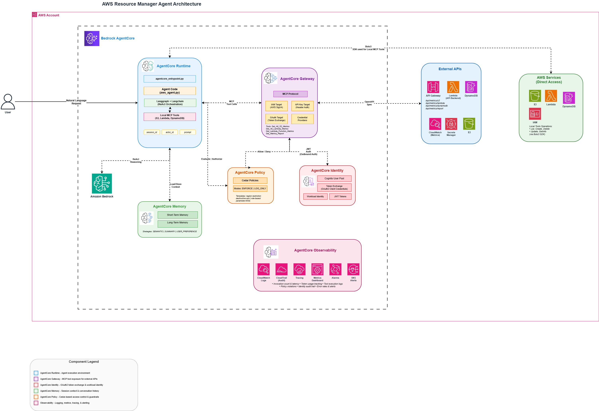

# AWS Resource Manager - Complete AgentCore Reference Implementation

> A comprehensive **AWS Bedrock AgentCore** reference implementation demonstrating **all five AgentCore components**: Runtime, Gateway, Identity, Memory, and Policy. This application provides an AI-powered interface to manage AWS resources through natural language interactions.

**Quick Start**: See [docs/DEPLOYMENT_GUIDE.md](docs/DEPLOYMENT_GUIDE.md) for setup and deployment instructions ⚡

---

## Table of Contents

1. [Overview](#overview)
2. [Architecture](#architecture)
3. [AWS AgentCore Components](#aws-agentcore-components)
   - [AgentCore Runtime](#agentcore-runtime)
   - [AgentCore Gateway](#agentcore-gateway)
   - [AgentCore Identity](#agentcore-identity)
   - [AgentCore Memory](#agentcore-memory)
   - [AgentCore Policy](#agentcore-policy)
4. [Project Structure](#project-structure)
5. [Documentation](#documentation)
6. [Support](#support)

---

## Overview

### What is This?

This application is a **complete reference implementation** of all AWS Bedrock AgentCore components. It demonstrates how to build a production-ready AI agent that:

- **Manages AWS Resources** through natural language (S3, Lambda, DynamoDB)
- **Exposes Existing APIs** as MCP tools without modifying API code
- **Authenticates Securely** using workload identity and token exchange
- **Remembers Conversations** with short-term and long-term memory
- **Enforces Guardrails** with Cedar policy-based access control

### Key Features

| Feature | AgentCore Component | Description |
|---------|---------------------|-------------|
| **Natural Language Interface** | Runtime | Interact with AWS using plain English |
| **MCP Tool Exposure** | Gateway | Expose existing APIs as standardized tools |
| **Secure Authentication** | Identity | Workload identity with OAuth2 token exchange |
| **Conversation Memory** | Memory | Session context and personalized experiences |
| **Access Control** | Policy | Cedar-based guardrails and access restrictions |
| **S3 Management** | Runtime + Tools | Create, configure, manage S3 buckets |
| **Lambda Management** | Runtime + Tools | Create, update, manage Lambda functions |
| **DynamoDB Management** | Runtime + Tools | Create, configure DynamoDB tables |
| **Metrics & Monitoring** | Gateway | Retrieve CloudWatch metrics via external APIs |

### Technology Stack

| Component | Technology | Role |
|-----------|------------|------|
| **LLM** | AWS Bedrock (Claude 3 Sonnet) | AI decision-making & reasoning |
| **Agent Orchestration** | Langgraph 0.0.40+ | State machine workflow & routing |
| **LLM Integration** | Langchain 0.1+ | LLM wrapper, tools, prompts |
| **Tools Protocol** | Model Context Protocol (MCP) | Standardized tool interface |
| **Runtime** | AWS Bedrock AgentCore Runtime | Production execution environment |
| **Gateway** | AWS Bedrock AgentCore Gateway | MCP tool exposure with OpenAPI integration |
| **Identity** | AWS Bedrock AgentCore Identity | Workload identity & token exchange |
| **Memory** | AWS Bedrock AgentCore Memory | Conversation context & personalization |
| **Policy** | AWS Bedrock AgentCore Policy | Cedar-based access control |
| **Language** | Python 3.11+ | Core implementation |
| **AWS SDK** | Boto3 1.34+ | AWS service integration |

---


## Architecture

### High Level Architecture


<p align="center">
  
</p>


---

## AWS AgentCore Components

This application demonstrates the complete AWS AgentCore ecosystem with all five components working together.

### AgentCore Runtime

**AgentCore Runtime** is the production execution environment for AI agents.

| Feature | Description |
|---------|-------------|
| **Container Deployment** | Runs your agent code in a managed Docker container |
| **Invocation Endpoint** | Provides a secure endpoint for agent invocations |
| **Environment Isolation** | Each agent runs in isolated environment |
| **Scaling** | Automatic scaling based on invocation load |
| **Logging** | CloudWatch integration for logs and monitoring |

**Key Files:**
- [agentcore_entrypoint.py](src/agentcore_entrypoint.py) - Main handler invoked by AgentCore Runtime
- [agent/aws_agent.py](src/agent/aws_agent.py) - Langgraph StateGraph with ReAct reasoning
- `.bedrock_agentcore.yaml` - Agent configuration and deployment settings

→ **Setup**: See [DEPLOYMENT_GUIDE.md - Quick Start](docs/DEPLOYMENT_GUIDE.md#quick-start)

---

### AgentCore Gateway

**AgentCore Gateway** exposes existing APIs as MCP (Model Context Protocol) tools without modifying the original API code.

| Feature | Description |
|---------|-------------|
| **OpenAPI Integration** | Automatically converts OpenAPI specs to MCP tools |
| **Multiple Targets** | Support for multiple API endpoints and authentication types |
| **JWT Authentication** | Cognito-based OAuth2 token validation |
| **IAM Authentication** | AWS SigV4 signing for AWS service endpoints |
| **API Key Support** | API key-based authentication for third-party APIs |

**Target Types:**

| Target Type | Authentication | Use Case |
|-------------|----------------|----------|
| **IAM Target** | AWS SigV4 | AWS services, API Gateway with IAM auth |
| **API Key Target** | API Key header | Third-party APIs, custom endpoints |
| **OAuth Target** | Bearer token | OAuth2-protected APIs |

**Gateway Tools Exposed:**

| Tool Name | Target | Description |
|-----------|--------|-------------|
| `Get_All_S3_Metrics` | IAM | Get metrics for all S3 buckets |
| `Get_All_Lambda_Metrics` | IAM | Get metrics for all Lambda functions |
| `Get_Lambda_Function_Metrics` | IAM | Get metrics for specific Lambda |
| `Get_Metrics_Report` | API Key | Generate consolidated metrics report |

→ **Setup**: See [DEPLOYMENT_GUIDE.md - Gateway Setup](docs/DEPLOYMENT_GUIDE.md#agentcore-gateway-setup)

---

### AgentCore Identity

**AgentCore Identity** provides secure workload identity for agents, enabling OAuth2 token exchange with external identity providers like AWS Cognito.

| Feature | Description |
|---------|-------------|
| **Workload Identity** | Agent-specific identity without embedding credentials |
| **Token Exchange** | Exchange agent credentials for external tokens |
| **OAuth2 Support** | Client credentials flow with Cognito |
| **Automatic Refresh** | Token caching and automatic refresh |
| **Audit Trail** | All token exchanges are logged |

**Token Exchange Flow:**

```
Agent Runtime → AgentCore Identity → AWS Cognito → JWT Token → Gateway Access
```

1. Agent requests token for gateway access
2. Identity service exchanges credentials with Cognito
3. JWT token returned to agent
4. Agent uses JWT to call Gateway

→ **Setup**: See [DEPLOYMENT_GUIDE.md - Identity](docs/DEPLOYMENT_GUIDE.md#agentcore-identity)

---

### AgentCore Memory

**AgentCore Memory** enables agents to maintain conversation context, remember user preferences, and deliver personalized experiences over time.

| Feature | Description |
|---------|-------------|
| **Short-Term Memory** | Session-based conversation context (7 days) |
| **Long-Term Memory** | Persistent facts, preferences, summaries (30 days) |
| **Session Management** | Group conversations by session ID |
| **Actor Tracking** | Track different users/actors |
| **Extraction Strategies** | Automatic extraction of facts and summaries |

**Memory Types:**

| Type | Expiry | Strategies | Use Case |
|------|--------|------------|----------|
| **Short-Term** | 7 days | None (raw events) | Session context, conversation continuity |
| **Long-Term** | 30 days | SEMANTIC, SUMMARY, USER_PREFERENCE | Cross-session personalization |

**How It Works:**
- Pass `session_id` in the request payload
- Agent loads conversation history from memory
- Context injected into system prompt
- After response, conversation stored to memory

→ **Setup**: See [DEPLOYMENT_GUIDE.md - Memory Setup](docs/DEPLOYMENT_GUIDE.md#agentcore-memory-setup)

---

### AgentCore Policy

**AgentCore Policy** provides guardrails and access control for agent tool invocations using **Cedar policies**. It enables fine-grained control over what actions agents can perform.

| Feature | Description |
|---------|-------------|
| **Cedar Policies** | Declarative policy language for access control |
| **ENFORCE Mode** | Block actions that violate policies |
| **LOG_ONLY Mode** | Audit mode for testing policies |
| **NL2Cedar** | Generate Cedar policies from natural language |
| **Principal Tags** | Role-based access using JWT claims |
| **Context Conditions** | Access control based on tool input parameters |

**Policy Enforcement Modes:**

| Mode | Behavior | Use Case |
|------|----------|----------|
| **ENFORCE** | Block violating actions, deny by default | Production |
| **LOG_ONLY** | Log violations, allow execution | Testing, auditing |

**Pre-Built Policy Templates:**

| Template | Purpose |
|----------|---------|
| `region-restriction` | Limit tools to specific AWS regions |
| `destructive-ops` | Block delete operations on protected resources |
| `role-based` | Require specific principal tags for actions |
| `parameter-limits` | Enforce numeric parameter constraints |

**Action Naming Convention:**
Gateway tool actions follow the format: `<target-name>___<tool-name>` (triple underscore)

Example: `resource-metrics-iam-target___Get_All_S3_Metrics`

→ **Setup**: See [DEPLOYMENT_GUIDE.md - Policy Setup](docs/DEPLOYMENT_GUIDE.md#agentcore-policy-setup)

---

### Request Flow

1. **User** sends natural language request with optional `session_id`
2. **AgentCore Runtime** receives request, loads **Memory** context
3. **Bedrock LLM** (Claude 3) performs ReAct reasoning to understand intent
4. Agent selects appropriate **tool** based on the request:

   **Path A - Local Tools:**
   - Agent invokes MCP Tool (e.g., `CreateS3Bucket`)
   - Tool executes via Boto3 directly against AWS services
   - Result returns to agent

   **Path B - Gateway Tools:**
   - **AgentCore Identity** provides JWT token
   - **AgentCore Policy** evaluates Cedar policies
   - If permitted, **AgentCore Gateway** routes to external API
   - Result returns to agent

5. **AgentCore Memory** stores conversation
6. **User** receives natural language response

---

### Component Dependencies

| Component | Depends On | Required For |
|-----------|------------|--------------|
| **Runtime** | None | All other components |
| **Gateway** | Runtime | Gateway tools, Policy |
| **Identity** | Gateway (Cognito) | Gateway authentication |
| **Memory** | Runtime | Session persistence |
| **Policy** | Gateway | Access control |

---

## Project Structure

| Directory | Purpose |
|-----------|---------|
| `src/` | Main source code |
| `src/agent/` | Langgraph StateGraph agent orchestrator |
| `src/bedrock/` | AWS Bedrock API client and Langchain integration |
| `src/mcp_tools/` | **Local Tools** - MCP tool implementations (S3, Lambda, DynamoDB) |
| `src/agentcore_gateway/` | **Gateway** setup scripts (IAM, Cognito, Gateway) |
| `src/gateway_integration/` | **Identity** - MCP client with OAuth2 token exchange |
| `src/memory/` | **Memory** - Session and event management |
| `src/policy/` | **Policy** - Cedar policy management |
| `src/config/` | Application configuration |
| `src/utils/` | Utility functions |
| `docs/` | Documentation files |

### Key Configuration Files

| File | Purpose |
|------|---------|
| `.bedrock_agentcore.yaml` | Agent deployment configuration |
| `gateway_config.json` | Gateway, Cognito, and target configuration |
| `memory_config.json` | Memory resource configuration |
| `policy_config.json` | Policy engine configuration |

---

## Documentation

| Document | Description |
|----------|-------------|
| [DEPLOYMENT_GUIDE.md](docs/DEPLOYMENT_GUIDE.md) | Full deployment guide with all setup commands, configuration, and security |
| [TESTING_GUIDE.md](docs/TESTING_GUIDE.md) | Usage examples, local testing, troubleshooting |

---

## Support

### Official Documentation

- **AWS Bedrock**: https://docs.aws.amazon.com/bedrock/
- **AWS Bedrock AgentCore**: https://docs.aws.amazon.com/bedrock/latest/userguide/agents-core.html

### Frameworks

- **Langchain**: https://python.langchain.com/
- **Langgraph**: https://langchain-ai.github.io/langgraph/
- **MCP Protocol**: https://modelcontextprotocol.io/
- **Cedar Policy Language**: https://www.cedarpolicy.com/

---
