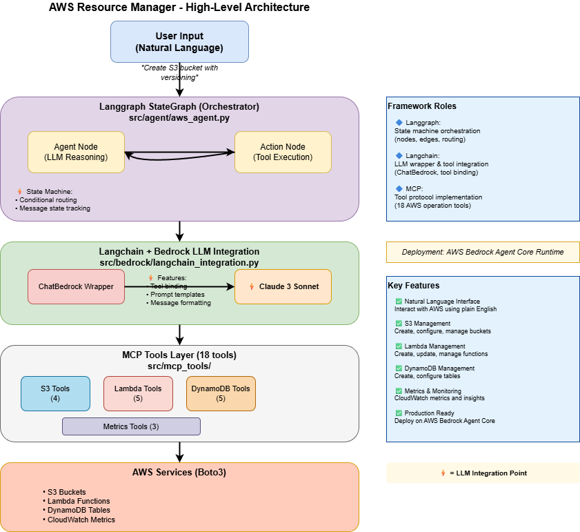

# AWS Resource Manager - Agentic AI Application

> An intelligent AWS resource management application powered by AWS Bedrock LLM, Langchain/Langgraph agents, and MCP tools for natural language-based infrastructure management.

**Quick Start**: See [docs/QUICK_GUIDE.md](docs/QUICK_GUIDE.md) | **Deploy in 5 minutes** ⚡


---

## Table of Contents

1. [Overview](#overview)
2. [Quick Start](#quick-start)
3. [Architecture](#architecture)
4. [Request Flow](#request-flow)
5. [LLM Integration Points](#llm-integration-points)
6. [Project Structure](#project-structure)
7. [Deployment Guide](#deployment-guide)
8. [Usage Examples](#usage-examples)
9. [Monitoring & Operations](#monitoring--operations)
10. [Security](#security)
10. [Testing](#testing)

---

## Overview

### What is This?

This application provides an **AI-powered interface** to manage AWS resources through natural language interactions. It uses **AWS Bedrock LLM models** (Claude 3 Sonnet) to understand commands and orchestrate AWS operations through a **Langgraph state machine** with **Langchain tool integration** and **MCP (Model Context Protocol) tools**.

**Architecture Highlights:**
- 🤖 **Langgraph StateGraph**: Multi-step agent workflow with conditional routing
- 🔗 **Langchain Integration**: ChatBedrock wrapper with tool binding
- ⚡ **Claude 3 Sonnet**: AWS Bedrock LLM for reasoning and decision-making
- 🛠️ **MCP Tools**: 18 standardized AWS operation tools

### Key Features

✅ **Natural Language Interface**: Interact with AWS using plain English  
✅ **S3 Management**: Create, configure, manage buckets (bucket-level only)  
✅ **Lambda Management**: Create, update, manage Lambda functions  
✅ **DynamoDB Management**: Create, configure tables (table-level only)  
✅ **Metrics & Monitoring**: Retrieve CloudWatch metrics and insights  
✅ **No Data Operations**: Infrastructure-only (no S3 objects, no DynamoDB scans)  
✅ **Production Ready**: Deploy on AWS Bedrock Agent Core in minutes  

### Technology Stack

| Component | Technology | Role |
|-----------|------------|------|
| **LLM** | AWS Bedrock (Claude 3 Sonnet) | AI decision-making & reasoning |
| **Agent Orchestration** | Langgraph 0.0.40+ | State machine workflow & routing |
| **LLM Integration** | Langchain 0.1+ | LLM wrapper, tools, prompts |
| **Tools Protocol** | Model Context Protocol (MCP) | Standardized tool interface |
| **Deployment** | AWS Bedrock Agent Core | Production runtime environment |
| **Language** | Python 3.11+ | Core implementation |
| **AWS SDK** | Boto3 1.34+ | AWS service integration |

**Framework Architecture:**
- **Langchain**: Provides LLM abstractions (`ChatBedrock`), tool definitions, and prompt templates
- **Langgraph**: Manages agent state machine with conditional routing and multi-step workflows
- **Integration**: Langchain tools are bound to LLM, Langgraph orchestrates the execution flow

---

## Quick Start

### Prerequisites

- Python 3.11+
- AWS Account with Bedrock access
- AWS CLI configured (`aws configure`)
- Bedrock model access enabled (Claude 3 Sonnet)

### Deploy to AWS (5-8 minutes)

```bash
# Install AgentCore CLI
pip install bedrock-agentcore bedrock-agentcore-starter-toolkit

# Navigate to src directory
cd src

# Configure your agent
agentcore configure -e agentcore_entrypoint.py

# Deploy to AWS
agentcore launch

# Test your agent
agentcore invoke '{"prompt":"List all S3 buckets"}'
```


### Local Development

```bash
# Setup environment
python -m venv venv
source venv/bin/activate  # Windows: venv\Scripts\activate
pip install -r src/requirements.txt

# Configure
cp .env.example .env
# Edit .env with your AWS credentials

# Run locally
python src/main.py
```

---

## High Level Architecture




### Deployment Architecture

```
User → AWS Bedrock Agent Core Runtime
         ↓
    Python Code Package (agentcore_entrypoint.py)
         ↓
    AWSResourceAgent (Langgraph StateGraph)
         │
         ├──▶ Agent Node: LLM Reasoning (Langchain ChatBedrock) ⚡
         │
         └──▶ Action Node: Tool Execution (MCP Tools)
         ↓
    AWS Services (S3, Lambda, DynamoDB)

Framework Roles:
• Langgraph: State machine orchestration (nodes, edges, routing)
• Langchain: LLM wrapper & tool integration (ChatBedrock, tool binding)
• MCP: Tool protocol implementation (18 AWS operation tools)
```

---

## Request Flow

### Complete Request/Response Flow

```
User: "Create S3 bucket test-bucket"
  ↓
AgentCore Runtime receives request
  ↓
agentcore_entrypoint.py: agent_invocation()
  ↓
AWSResourceAgent: execute(prompt)
  ↓
Langgraph State Machine starts
  ↓
⚡ LLM (Claude 3): Analyze "Create S3 bucket test-bucket"
  → Decision: "Use CreateS3BucketTool"
  ↓
CreateS3BucketTool: execute()
  ↓
AWS S3 API: create_bucket()
  ↓
Result: {success: true, bucket: "test-bucket"}
  ↓
⚡ LLM (Claude 3): Generate response from result
  → "Successfully created S3 bucket test-bucket"
  ↓
Return to AgentCore
  ↓
Response to User: "✅ Bucket created successfully"
```

### Detailed Step-by-Step Flow

1. **User Input**: User sends natural language command
2. **AgentCore Entry**: `agentcore_entrypoint.py` receives payload
3. **Agent Initialization**: Get/create singleton agent instance
4. **State Setup**: Create initial Langgraph state with user message
5. **LLM Reasoning** ⚡: Claude analyzes intent and selects tool
6. **Tool Execution**: MCP tool executes AWS API call
7. **Result Processing**: Tool returns structured result
8. **LLM Response** ⚡: Claude generates natural language response
9. **Return to User**: Formatted response sent back

---

## LLM Integration Points

⚡ **Detailed LLM integration documentation**: 

The system uses **Langchain + Langgraph + AWS Bedrock** at **6 key integration points**:

1. **Configuration Layer** (`src/config/settings.py`)
   - LLM model selection and parameters
   - Framework: Configuration management

2. **Bedrock Client** (`src/bedrock/client.py`)
   - Direct AWS Bedrock API communication
   - Framework: Low-level Bedrock wrapper

3. **Langchain Integration** (`src/bedrock/langchain_integration.py`) ⚡
   - ChatBedrock wrapper with tool binding
   - Framework: **Langchain** - LLM abstraction layer

4. **Agent Orchestrator** (`src/agent/aws_agent.py`) ⚡
   - StateGraph with agent/action nodes
   - Framework: **Langgraph** - State machine orchestration

5. **Local Development** (`src/main.py`)
   - Interactive CLI with LLM workflow
   - Framework: Langchain + Langgraph integration

6. **Production Deployment** (`src/agentcore_entrypoint.py`)
   - AWS AgentCore runtime integration
   - Framework: Full Langchain + Langgraph stack

**How They Work Together:**
- **Langchain** provides `ChatBedrock` (LLM wrapper) + tool definitions
- **Langgraph** orchestrates multi-step workflow with state management
- **Bedrock** provides Claude 3 Sonnet for reasoning and decision-making

---

## Project Structure

```
aws-agent-core-sample-application/
├── .env.example                # Environment variables template
├── .gitignore                  # Git ignore rules
├── .vscode/                    # VS Code settings
├── pyproject.toml              # Python project metadata
├── readme.md                   # This file (comprehensive guide)
├── architecture.drawio         # Architecture diagram (draw.io format)
├── invoke_agent.py             # Script to invoke deployed agent
├── agent-permissions-policy.json  # IAM permissions for agent
├── docs/
│   ├── QUICK_GUIDE.md          # Quick reference guide
│   ├── LOCAL_TESTING_GUIDE.md  # Local testing instructions
│   └── architecture.png        # Architecture diagram image
│
└── src/
    ├── __init__.py
    ├── requirements.txt        # Python dependencies
    ├── agentcore_entrypoint.py # ⚡ Production entrypoint (AgentCore)
    ├── main.py                 # ⚡ Local development entrypoint
    │
    ├── agent/
    │   ├── __init__.py
    │   └── aws_agent.py        # ⚡ Langgraph StateGraph (agent workflow)
    │
    ├── bedrock/
    │   ├── __init__.py
    │   ├── client.py           # ⚡ AWS Bedrock API client (low-level)
    │   └── langchain_integration.py  # ⚡ Langchain ChatBedrock wrapper
    │
    ├── mcp_tools/
    │   ├── __init__.py
    │   ├── base_tool.py        # Abstract base class for tools
    │   ├── s3_tools.py         # 4 S3 bucket management tools
    │   ├── lambda_tools.py     # 5 Lambda function management tools
    │   ├── dynamodb_tools.py   # 5 DynamoDB table management tools
    │   └── metrics_tools.py    # 3 CloudWatch metrics tools
    │
    ├── config/
    │   ├── __init__.py
    │   └── settings.py         # ⚡ Application config (LLM model ID)
    │
    └── utils/
        ├── __init__.py
        └── helpers.py          # Utility functions
```

**Key Files Explained:**

| File | Purpose | Framework | LLM Integration |
|------|---------|-----------|----------------|
| `src/agentcore_entrypoint.py` | Production deployment entry point | AgentCore | ⚡ Yes - triggers workflow |
| `src/main.py` | Local development CLI | Langchain+Langgraph | ⚡ Yes - triggers workflow |
| `src/agent/aws_agent.py` | StateGraph agent orchestrator | **Langgraph** | ⚡ Yes - state machine |
| `src/bedrock/langchain_integration.py` | ChatBedrock wrapper with tools | **Langchain** | ⚡ Yes - LLM wrapper |
| `src/bedrock/client.py` | Low-level Bedrock API client | Boto3 | ⚡ Yes - invokes LLM |
| `src/config/settings.py` | Application configuration | Pydantic | ⚡ Yes - model ID |
| `src/mcp_tools/*.py` | AWS operation tools | ❌ No - executes AWS APIs |

---

## Deployment Guide

### Prerequisites

1. **Python 3.11+** installed
2. **AWS Account** with appropriate permissions
3. **AWS CLI** configured (`aws configure`)
4. **AWS Bedrock Access** enabled
5. **Model Access** - Claude 3 Sonnet approved

### Step 1: Enable Bedrock Model Access

```bash
# Check Bedrock access
aws bedrock list-foundation-models --region us-east-1

# If empty, enable in AWS Console:
# 1. Go to AWS Bedrock console
# 2. Click "Model access" in left menu
# 3. Click "Manage model access"
# 4. Enable "Anthropic Claude 3 Sonnet"
# 5. Click "Save changes"
```

### Step 2: Install AgentCore CLI

```bash
pip install bedrock-agentcore bedrock-agentcore-starter-toolkit
```

### Step 3: Configure Agent

```bash
# Navigate to src directory
cd src

# Configure agent
agentcore configure -e agentcore_entrypoint.py
```

**Interactive prompts**:
- Agent Name: `aws-resource-manager`
- AWS Region: `us-east-1` (or your region)
- Memory (MB): `2048`
- Timeout (seconds): `300`

This creates `.agentcoreconfig` file (already included in src/ directory).

### Step 4: Deploy to AWS

```bash
agentcore launch
```

**What happens**:
1. ✅ Validates Python code
2. ✅ Packages application (src/ + requirements.txt)
3. ✅ Uploads to S3 (managed by AWS)
4. ✅ Creates IAM role with permissions
5. ✅ Deploys AgentCore Runtime
6. ✅ Configures CloudWatch logging
7. ✅ Returns Agent ID

**Output**:
```
✓ Validating configuration...
✓ Packaging application...
✓ Uploading to S3...
✓ Creating IAM role...
✓ Deploying AgentCore Runtime...

✅ Deployment successful!

Agent ID: abcd1234-5678-90ef-ghij-klmnopqrstuv
Agent Name: aws-resource-manager
Region: us-east-1

Test your agent:
  agentcore invoke '{"prompt":"List all S3 buckets"}'
```

### Step 5: Test Agent

```bash
# Simple test
agentcore invoke '{"prompt":"List all S3 buckets"}'

# Create S3 bucket
agentcore invoke '{"prompt":"Create S3 bucket test-bucket-2026 with versioning enabled"}'

# List Lambda functions
agentcore invoke '{"prompt":"List all Lambda functions"}'

# Get metrics
agentcore invoke '{"prompt":"Show metrics for S3 bucket test-bucket-2026 for last 7 days"}'
```

### Step 6: Monitor

```bash
# Stream logs in real-time
agentcore logs --follow

# Get last 100 lines
agentcore logs --tail 100

# Filter errors
agentcore logs --level ERROR

# Check health
agentcore healthcheck
```

### Step 7: Update Agent

```bash
# Make code changes, then:
agentcore update
```

### Step 8: Cleanup

```bash
# Delete agent and all resources
agentcore destroy
```

---

## Usage Examples

### Example 1: Create S3 Bucket

**Command**:
```bash
agentcore invoke '{"prompt":"Create an S3 bucket named my-app-data-2026 with versioning and encryption enabled"}'
```

**Agent Flow**:
1. User input received
2. LLM analyzes: "Need to create S3 bucket" ⚡
3. LLM selects: CreateS3BucketTool ⚡
4. Tool executes: boto3.create_bucket()
5. LLM generates response: "Successfully created..." ⚡

**Response**:
```json
{
  "result": "Successfully created S3 bucket 'my-app-data-2026' with the following configuration:\n- Region: us-east-1\n- Versioning: Enabled\n- Encryption: AES256 enabled\n- Public Access: Blocked",
  "success": true,
  "metadata": {
    "model": "anthropic.claude-3-sonnet-20240229-v1:0",
    "execution_time_ms": 1234.56
  }
}
```

### Example 2: List Lambda Functions

**Command**:
```bash
agentcore invoke '{"prompt":"List all Lambda functions in my account"}'
```

**Response**:
```json
{
  "result": "Found 3 Lambda functions in your account:\n\n1. data-processor-function\n   - Runtime: Python 3.11\n   - Memory: 256 MB\n   - Timeout: 30 seconds\n   - Last Modified: 2026-01-15\n\n2. api-handler\n   - Runtime: Node.js 20.x\n   - Memory: 512 MB\n   - Timeout: 60 seconds\n   - Last Modified: 2026-01-10\n\n3. event-processor\n   - Runtime: Python 3.11\n   - Memory: 1024 MB\n   - Timeout: 300 seconds\n   - Last Modified: 2026-01-05",
  "success": true
}
```

### Example 3: Create DynamoDB Table

**Command**:
```bash
agentcore invoke '{"prompt":"Create a DynamoDB table named Users with partition key userId (string) and sort key timestamp (number)"}'
```

**Response**:
```json
{
  "result": "Successfully created DynamoDB table 'Users' with the following configuration:\n- Partition Key: userId (String)\n- Sort Key: timestamp (Number)\n- Billing Mode: On-Demand\n- Table Status: CREATING (will be ACTIVE in ~30 seconds)\n- Table ARN: arn:aws:dynamodb:us-east-1:123456789012:table/Users",
  "success": true
}
```

### Example 4: Get Metrics

**Command**:
```bash
agentcore invoke '{"prompt":"Show me metrics for Lambda function data-processor-function for the last 7 days"}'
```

**Response**:
```json
{
  "result": "Lambda Metrics for 'data-processor-function' (Last 7 days):\n\nInvocations:\n- Total: 1,245\n- Average per day: 178\n\nErrors:\n- Total: 12\n- Error Rate: 0.96%\n\nPerformance:\n- Average Duration: 234.5 ms\n- Maximum Duration: 1,203 ms\n- Minimum Duration: 87 ms\n\nThe function is performing well with a low error rate.",
  "success": true
}
```

### Example 5: Complex Multi-Step Command

**Command**:
```bash
agentcore invoke '{"prompt":"Create an S3 bucket for analytics, then create a Lambda function to process the data, and show me the current metrics"}'
```

**Agent Flow**:
1. LLM breaks down into 3 steps ⚡
2. Step 1: Create S3 bucket (CreateS3BucketTool)
3. Step 2: Create Lambda function (CreateLambdaFunctionTool)
4. Step 3: Get metrics (GetLambdaMetricsTool)
5. LLM generates summary ⚡

---

## Monitoring & Operations

### View Logs

```bash
# Stream real-time logs
agentcore logs --follow

# Get last 100 lines
agentcore logs --tail 100

# Filter by level
agentcore logs --level ERROR
agentcore logs --level INFO

# Search logs
agentcore logs --filter "bucket_name"
```

### Check Agent Status

```bash
# Get agent information
agentcore status

# Health check
agentcore healthcheck
```

### Update Agent

```bash
# After code changes
agentcore update
```

### Metrics & Performance

CloudWatch metrics available:
- Invocation count
- Success/failure rate
- Execution time (avg/max/min)
- LLM token usage
- Tool execution count

### Troubleshooting

#### Issue: Agent not responding
```bash
# Check status
agentcore status

# View recent logs
agentcore logs --tail 50

# Health check
agentcore healthcheck
```

#### Issue: Bedrock Access Denied
```bash
# Verify model access
aws bedrock list-foundation-models --region us-east-1

# If empty, enable in AWS Console:
# Bedrock → Model access → Manage → Enable Claude 3 Sonnet
```

#### Issue: Tool execution failed
```bash
# View error logs
agentcore logs --level ERROR

# Common causes:
# - IAM permissions missing
# - Resource doesn't exist
# - Invalid parameters
```

---

## Security

### IAM Permissions

The agent requires these permissions (automatically configured):

```json
{
  "Version": "2012-10-17",
  "Statement": [
    {
      "Effect": "Allow",
      "Action": [
        "s3:CreateBucket",
        "s3:DeleteBucket",
        "s3:ListAllMyBuckets",
        "s3:GetBucketLocation",
        "s3:GetBucketVersioning",
        "s3:PutBucketVersioning",
        "s3:GetEncryptionConfiguration",
        "s3:PutEncryptionConfiguration",
        "s3:GetPublicAccessBlock",
        "s3:PutPublicAccessBlock"
      ],
      "Resource": "*"
    },
    {
      "Effect": "Allow",
      "Action": [
        "lambda:CreateFunction",
        "lambda:DeleteFunction",
        "lambda:GetFunction",
        "lambda:GetFunctionConfiguration",
        "lambda:ListFunctions",
        "lambda:UpdateFunctionCode",
        "lambda:UpdateFunctionConfiguration"
      ],
      "Resource": "*"
    },
    {
      "Effect": "Allow",
      "Action": [
        "dynamodb:CreateTable",
        "dynamodb:DeleteTable",
        "dynamodb:DescribeTable",
        "dynamodb:ListTables",
        "dynamodb:UpdateTable"
      ],
      "Resource": "*"
    },
    {
      "Effect": "Allow",
      "Action": [
        "cloudwatch:GetMetricStatistics",
        "cloudwatch:ListMetrics"
      ],
      "Resource": "*"
    },
    {
      "Effect": "Allow",
      "Action": [
        "bedrock:InvokeModel",
        "bedrock:InvokeModelWithResponseStream"
      ],
      "Resource": "arn:aws:bedrock:*::foundation-model/anthropic.claude-3-sonnet-*"
    }
  ]
}
```

### Data Protection

- ✅ **No Data Access**: System cannot access S3 objects or DynamoDB items
- ✅ **Infrastructure Only**: Limited to bucket/table/function management
- ✅ **Encryption**: Enables encryption by default for S3 buckets
- ✅ **Public Access Blocking**: Automatically blocks public S3 access
- ✅ **Audit Logging**: All operations logged to CloudWatch

### Best Practices

1. **Enable MFA** for AWS account
2. **Use least-privilege IAM** roles
3. **Enable CloudTrail** for audit logs
4. **Review logs regularly** for suspicious activity
5. **Rotate credentials** periodically
6. **Use tags** for resource organization and cost tracking

---

## Testing

### Run Tests Locally
See [docs/LOCAL_TESTING_GUIDE.md](docs/LOCAL_TESTING_GUIDE.md)

```bash
# Install test dependencies
pip install pytest pytest-cov pytest-asyncio moto

# Run all tests
pytest tests/ -v

# Run with coverage
pytest tests/ --cov=src --cov-report=html

# Run specific test file
pytest tests/test_s3_tools.py -v

# Run specific test
pytest tests/test_s3_tools.py::test_create_bucket -v
```

### Test Structure

```
tests/
├── conftest.py              # Pytest configuration and fixtures
├── test_s3_tools.py         # S3 tools tests
├── test_lambda_tools.py     # Lambda tools tests
├── test_dynamodb_tools.py   # DynamoDB tools tests
└── test_agent.py            # Agent integration tests
```

### Example Test

```python
import pytest
from moto import mock_aws
from src.mcp_tools.s3_tools import CreateS3BucketTool, CreateS3BucketInput

@mock_aws
@pytest.mark.asyncio
async def test_create_s3_bucket():
    """Test S3 bucket creation"""
    tool = CreateS3BucketTool()
    
    input_data = CreateS3BucketInput(
        bucket_name="test-bucket",
        versioning_enabled=True,
        encryption_enabled=True
    )
    
    result = await tool.execute(input_data)
    
    assert result.success == True
    assert "test-bucket" in result.message
    assert result.data["versioning"] == True
```

---

## FAQ

### Q: What LLM models are supported?
**A**: Currently Claude 3 Sonnet (anthropic.claude-3-sonnet-20240229-v1:0). You can configure other Bedrock models by changing `bedrock_model_id` in settings.

### Q: Can I perform data operations (S3 objects, DynamoDB scans)?
**A**: No, by design. This system focuses on infrastructure management only.

### Q: How much does it cost?
**A**: 
- AgentCore Runtime: ~$50-100/month
- Bedrock LLM usage: Pay-per-token (~$0.003/1K tokens for Claude 3 Sonnet)
- AWS services: Standard S3/Lambda/DynamoDB costs

### Q: Can I add custom tools?
**A**: Yes! Create a new tool class inheriting from `BaseMCPTool` and add it to the agent.

### Q: How do I change the LLM model?
**A**: Edit `.env` file: `BEDROCK_MODEL_ID=anthropic.claude-3-5-sonnet-20240620-v1:0`

### Q: Is this production-ready?
**A**: Yes! Deployed on AWS Bedrock Agent Core with auto-scaling, monitoring, and security.

---

## Support

- **Quick Guide**: [docs/quick_guide.md](docs/QUICK_GUIDE.md)
- **AWS Bedrock Docs**: https://docs.aws.amazon.com/bedrock/
- **Langchain Docs**: https://python.langchain.com/
- **Langgraph Docs**: https://langchain-ai.github.io/langgraph/
- **MCP Protocol**: https://modelcontextprotocol.io/

---

**Built with ❤️ using AWS Bedrock, Langchain, and Langgraph**
